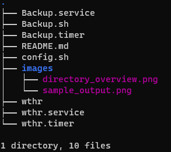
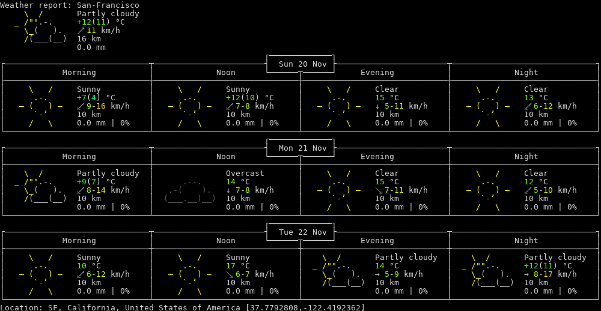

# ACIT 2420 Week 11 Lab

## Repository

### Team Member

+ **Munib Javed**
  + *A01221306*
+ **Nai Yen Lin**
  + *A01320713*


## Directory Overview



## Weather Service

Provide current ***weather information with location specified*** and store the results into file that can be opened and viewed

### wthr 
  + put this file in */opt/getweather/*     
  ```bash
  cp [directory-of-current-file] /opt/getweather
  ```

### wthr.service 
  + put this file in */etc/systemd/system/*     
  ```bash
  cp [directory-of-current-file] /etc/systemd/system
  ```

### wthr.timer
  + put this file in */etc/systemd/system/*     
  ```bash
  cp [directory-of-current-file] /etc/systemd/system
  ```

### Example Output
  + use vim to access the output      
  ```bash
  vim /etc/motd
  ```
  + the result shall look similar to this layout      
  


## Backup Service

Backup service operates ***every Friday at 01:00*** to the desitination of a backup server with directory spefified.

### backup

  1. Make a directory in /opt to store the backups      
  ```bash
  sudo mkdir /opt/backup
  ```
  2. Put this file in /opt/backup/      
  ```bash
  cp [directory-of-current-file] /opt/backup
  ```

### backup.service

  1. Put this file in /etc/systemd/system/      
  ```bash
  cp [directory-of-current-file] /etc/systemd/system
  ```
  2. Enable the service     
  ```bash
  systemctl enable backup.service     
  ```
  3. Verify service is active with command provided   
  ```bash
  systemctl status backup.service
  ```
    + Check following *criteria*  
      | Title       | Description  |
      | ----------- | ------------ |
      | Loaded      | loaded       |
      | Active      | inactive     |
      | TriggeredBy | backup.timer |

### backup.timer

  1. Put this file in /etc/systemd/system/    
  ```bash
  cp [directory-of-current-file] /etc/systemd/system
  ```
  2. Enable the timer   
  ```bash
  systemctl enable backup.timer   
  ```
  3. Start the timer with command provided    
  ```bash
  systemctl start --now backup.timer
  ```
  4. Verify timer is active with command provided   
  ```bash
  systemcl status backup.service
  ```
    + Check following *criteria*  
    | Title       | Description   |
    | ----------- | ------------- |
    | Loaded      | loaded        |
    | Active      | active        |
    | Triggers    | backup.service|
      

### config.sh

  1. Put this file in /opt/backup/    
  ```bash
  cp [directory-of-current-file] /opt/backup
  ```
  2. Specify ***dir*** of where backup shall be and the ***ip*** of backup server in **config.sh**